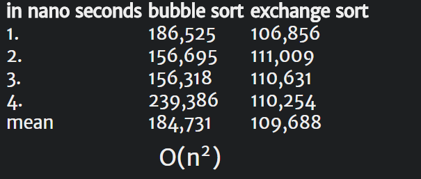
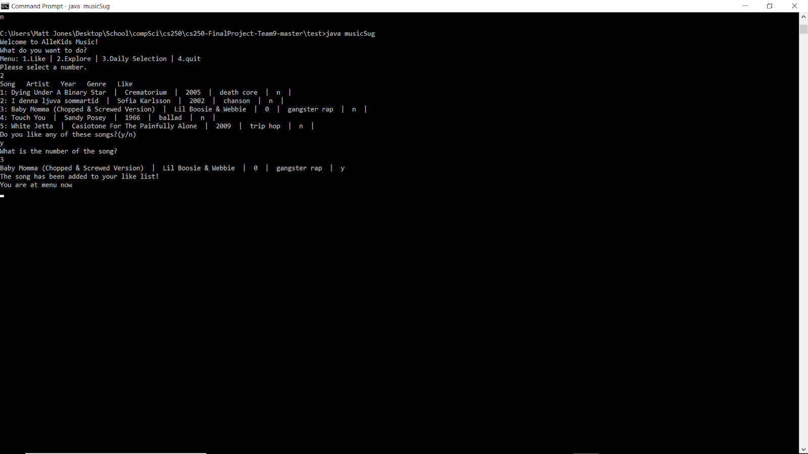
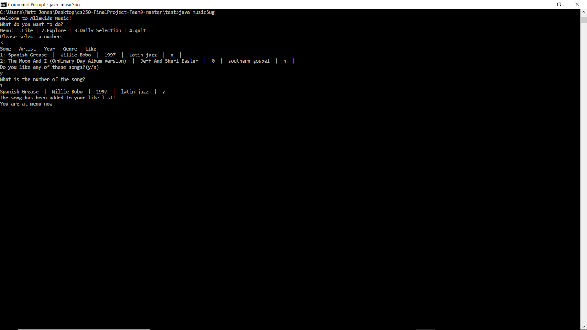

***

## Motivation

  Our team was inspired by existing music suggestion platforms (ie. Spotify, Pandora, Apple Music, etc,) to mimic their systems and add our own creative twist on current song suggesting algorithms. This includes features similar to other platforms including: "favorites" or "liked music", "DailyMix" and "Recommended for You", sorting features such as "by artist" and "by genre", and a "cloud database*" that would hold the list of all possible songs that the user can choose from.

  Our work also builds directly off the previous work submitted in this course, as well as building off existing algorithms in the field. We built directly off of the music-sorting lab we submitted earlier this year, to sort the users liked songs. The creative twist we added to our algorithm suggestion takes a look at how we listen to music from a different angle. Because music provides a "rhythm or beat" to many of the things we do (whether it's dancing, work, etc.), we decided to try to rate a user based on the speed of the rhythm (also known as Tempo).

#### Why is it important

  This work acts as valuable research to anyone in the music industry. Specifically, anyone who is looking at new ways to incorporate aspects of songs into a user-song-suggestion platform. While current music platforms are doing a good job of suggesting songs (usually based off other real peoples songs), there's still songs that users find out-of-the-blue on their own that they really enjoy. Exploring new ways to relate aspects of songs to the user can only help find these outlying songs, and suggest them to the user.

#### How is it useful

  Millions of people use music everyday. Whether it's to wake up to their favorite song in the morning, make their commute to their job better, or provide some-type of rhythm to everyday tasks, music makes our lives better! So, a tool which helps you find music you like, and save music you like would undoubtedly be useful to a lot of people.

## Background for problem

  There are many algorithms to find similar songs. Here are two examples of the Collaborative filtering:

#### Memory-based

Generally, user would be grouped in this algorithm. In this method, the algorithm will first track down people who have similar activities, then recommend songs to each other by their playlists. For example, action score could be assigned as:


  | Repeat song | Share | Like | Play | Played completely | Skip | Dislike |
  | :---: | :---: | :---: | :---: | :---: | :---: | :---: |
  |   5   |   4   |   3   |   2   |   1   |   -1  |   -5  |

  Then, a persons preference would be a N-Dimensional vector. Here N is the number of songs by default. By using the cosine of the vector angle, which is generated by two vector, we can know how similar two users can be. The cosine of 0 degree, which means two people are exactly the same, is 1. The cosine of 180 degree, which means two people have the opposite preference, is -1. The equation is:

Assume we have vector $\vec a$ and $\vec b$,

$$cos(A) = \frac{\vec a \cdot \vec b}{|\vec a| \times |\vec b|}$$

  This prediction method is very accurate, but there are too many calculations and it is not accurate for a new user.

#### Model-based

  As for the second method, the algorithm will analyze the playlist of a person, then do recommendations. Models such as the latent factor are used in this method. In latent factor model, user's like list will be analyzed by dividing into different tag factors, for example, classic and indie. By signing scores for different factor, we can have a matrix which can divided into two different matrix:

$$R = QP^T$$
$$R_{user,song}= Q_{user,factor} P^T_{factor,song}$$
$$=
\begin{pmatrix}
  q_{user_{1},factor_{1}} & q_{user_{1},factor_{2}} & \cdots & q_{user_{1},factor_{n}} \\
  q_{user_{2},factor_{1}} & q_{user_{2},factor_{2}} & \cdots & q_{user_{2},factor_{n}} \\
  \vdots  & \vdots  & \ddots & \vdots \\
  q_{user_{n},factor_{1}} & q_{user_{n},factor_{2}} & \cdots & q_{user_{n},factor_{n}}
  \end{pmatrix}$$
$$
  \begin{pmatrix}
  p_{factor_{1},song_{1}} & p_{factor_{1},song_{2}} & \cdots & p_{factor_{1},song_{n}} \\
  p_{factor_{2},song_{1}} & p_{factor_{2},song_{2}} & \cdots & p_{factor_{2},song_{n}} \\
  \vdots  & \vdots  & \ddots & \vdots \\
  p_{factor_{n},song_{1}} & p_{factor_{n},song_{2}} & \cdots & p_{factor_{n},song_{n}}
  \end{pmatrix}^T$$

  From the matrix R, we can get estimated score. After that, we can ignore the song which the user already listened, and recommend him the song he has not listened.

  Of course, in the real world, if we implement algorithm based on song, the second dimension factor will rapidly increase. Plus there will be too many songs. Therefore, it will be more efficient if we calculate based on tags of the song. For example, for "The Sound of Silence" by Simon & Garfunel, tags can be Folk Rock, 60s, and Movie Track. Due to the time we have is limited, we would not build tags databases, therefore we would analyze by songs.

  In the real situation, based on different requirements, we can pick one of them or use them together. It is also an option to mix these two algorithms and form a new hybrid algorithm when there are not enough songs in a playlist.

#### How could it be improved

  These algorithms are not perfect, they could be limited when there are not enough users. For example, if a start up music service company wants to suggest songs to user, they have to use an algorithm which works when there are not enough users and user action data. In this situation, it would be better if the company could depend on the music only, for example, music metadata, rather than depend on user data. In our algorithm, we hard coded melody scores, From 1 to 10, the faster the higher, for each songs. This score simulated music classification data. By getting a mean score from user liked list, we can find more songs by their mean score. This method is more like a weaker version of the combination of nature language processing and raw audio analyze. In nature language processing, the program would analyze the lyrics, then get the emotion data. In raw audio analyze, the program would analyze the audio frames, and finally get an score for audio characteristic.  


## Program and Algorithm Description

#### Pseudocode

```
  For each liked song:
    append to likedlist;
  mean = (sum of melodies)/likedListLength;
  for exploreSong['melody'] == mean:
    return song;
```

  This is a very basic description of the algorithm but it explains the though process behind the algorithm used to return songs. Essentially, we ask the user pick songs that they like. This will add those liked songs to the liked list. Using, the songs from the liked list, we find the mean of the melodies within the liked list. This mean is then used to search the main music database and return a set of songs that match the mean melody score of the liked list. The melody score is just one way we can return a set of recommended songs, there are other variables that can be and will be included in the future. The inclusion of these variables will not only give us a more desirable list of recommended songs for user but will also allow for options when returning a set of songs. For example, if a user wants a playlist to workout to, we may want to return songs with high melody scores that are more upbeat.

#### Diagram

  **Figure 1** is a basic outline of the interaction between classes in our program. The `music.csv` file is fed into `explore.java`, returning random songs with its explore function and also sends the liked songs to `liked.csv` with its add function. The liked songs are used by `DailySelection.java` and `Like.java`. DailySelection uses the algorithm discussed in the pseudocode to return songs that match the mean melody rating of the songs found in the liked list. The Like class sorts the liked list by either song, genre, artist, or year. `Like.java` calls `SortInt` to sort the year and `SortString.java` to sort the other categories. `MusicSug.java` is the main method and gives the user a command-line interface to interact with music recommender system, calling the functions mentioned above.

#### Time Complexities

  **Figure2** Represents the time complexities of the Bubble sort and Exchange sort after four runs. `SortInt.java` utilizes the bubble sort method to sort the year songs within the liked list. `SortString.java` utilizes exchange sort to sort each of the other categories. We found a worst-case time complexity of O(n^2^) for both sorting algorithms. We decided to used these algorithms because we do not anticipate large scale growth in our liked list in its current state. That is the program only accounts for a single user and the user will not produce enough songs on the liked list to mandate a different algorithm.

## Conclusion

#### Results

  While analyzing our results, note that our program doesn't take into account things like artist, genre, instruments used, etc. when suggesting songs. However, the program does take a unique approach to song suggesting, and runs without any bugs (caused by the user and/or built into our system).

  **Figure 3** shows the Main Menu of our program. It offers four options: Like (prints liked songs), Explore (Finds and adds new songs to the users liked songs), Daily Selection (Makes a playlist similar to the songs in the users liked-list), Quit (Exits the program)

  **Figure 4** shows the first feature: Print Liked Songs & Sort them.

  **Figure 5** shows the second feature: Finds 5 songs for the user, and the user picks a song (in this case, song 3) to add to their liked songs. Then **figure 6** shows the updated liked songs with new addition from feature #2.

  **Figure 7** shows the third feature: Gives you two song selections similar to your liked list tempo, and then the user adds these songs to their liked songs.

  **Figure 8** shows updated liked songs with new addition from feature #3.

  **Figure 9** shows the fourth feature: Quit/exits the program.

#### Takeaways
  There are a few notable takeaways from researching and implementing our final project. First, collaborative filtering algorithms are complex and take into account many, many variables. There are many components that make up a song, thus creating accurate predictions requires a lot of data. Second, collaborative is difficult to implement if multiple users are not involved. Our program only accounts for a single user and single liked list. An optimal implementation would call for multiple user's liked lists to be compared across the program, to find similar user interests so we can recommend songs based off of similar user's playlists and interests. Overall, are program is a solid first-step in implementing a music recommender that is capable of taking in unique parameters, such as melody score, to recommend songs to users.

#### Challenges

Their were a few obvious problems that our group encountered that was to be expected. Because our program has many different working parts, we had to split it up and then either comment the code in a way so that our other group members could explain it. Alternatively to commenting every bit of code, we also met many times to try to explain our code to the rest of the group.
	The biggest challenge our group had was working with the "cloud music list" (aka our Music.csv) and figuring out how to edit this list without messing us the csv file and the rest of our program. Our solution was to make a "working csv file" (Test.csv)  that was the file we actually made edits to, while the "cloud file" (Music.csv) was left alone so that the edits didn't cause any problems with the rest of the program.

### Rewards
 The process of this project as been rewarding at every step. The research that went into the project to learn about collaborative filtering and common algorithms used to recommend songs was interesting as we all frequently use these music apps. So, learning how these apps recommend daily playlists and songs that we may like is intriguing. Implementation was rewarding in its challenges. Every obstacle overcame was its own reward. We have newfound respect for programmers that are responsible for implementing and maintaining these algorithms because we know the amount of data and variables that goes into proper implementation.

## Index

 

 

 

 

 

 

 

 

 
