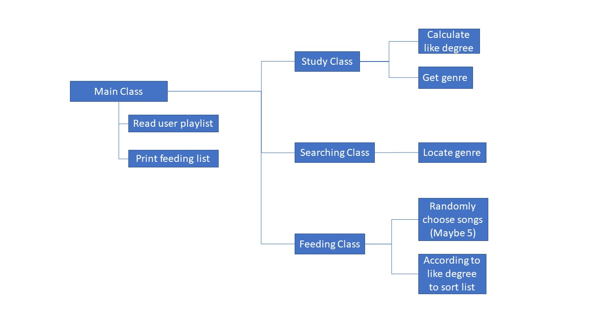

***

In our final project, we are going to implement track one which is explained in [instructions](https://github.com/TravisThomasAC/cs250-FinalProject-Team9/blob/master/instructions/project.pdf). Specifically, we are going to implement music feeding algorithms, which can study user performances, profile user listening preferences, and finally feed new songs to user.

There are two components to our program. The first component is a dataset which includes the user playlist, server-side playlist, and the user preference data. The User playlist data will come from a user playlist csv file, which stores the songs from server-side playlist that the user likes. The Server-side playlist data will come from the corresponding csv file which contains all playable songs. 
The second component is the java code. There will be a main class which will read the user playlist, and print the feed the final list. There will also be a study class which will scale the songs "likeness", and finally get a list of genres based off that likeness. The third class is the searching class, which will use a searching algorithm to locate each genre. Finally there will be a feeding class which will randomly choose songs from the list, and will reference the "likeness" or "like degree" to sort the feed list.

Figure 1 shows the mind map.

In this program, we would use a searching algorithm to locate specific genres, a priority queue to sort the suggestion list, and a array to store playlists.

Here are some source we should reference when creating our project:

1. Based on "like degree" and using the "like degree" as a priority index to sort the list.
  + [Priority queue](https://www.geeksforgeeks.org/priority-queue-class-in-java-2/)

2. This code can be used to read and write csv file. In this code, lines are handled by array or arrayList.
  + [Deal with csv file](https://examples.javacodegeeks.com/core-java/writeread-csv-files-in-java-example/)
  + [Read and write csv file](https://www.mkyong.com/java/how-to-read-and-parse-csv-file-in-java/)
  
3. Searching for a required genre by using binary search.
  + [Binary search](https://www.geeksforgeeks.org/binary-search/)

4. Sorting elements before searching.
  + [Quick sort](https://cathyatseneca.gitbooks.io/data-structures-and-algorithms/content/sorting/quick_sort.html)
